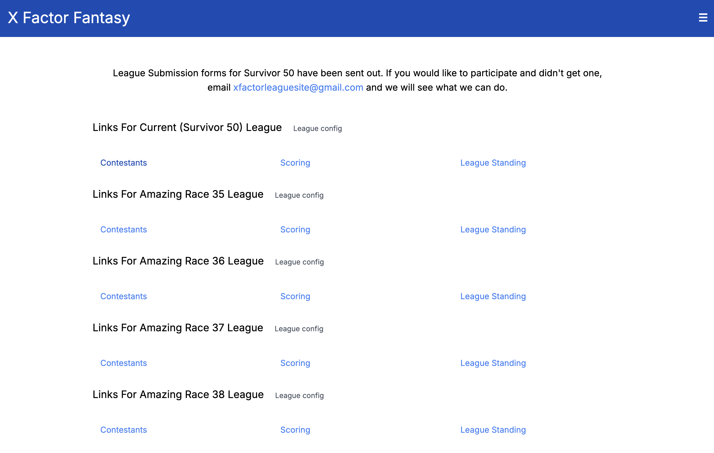
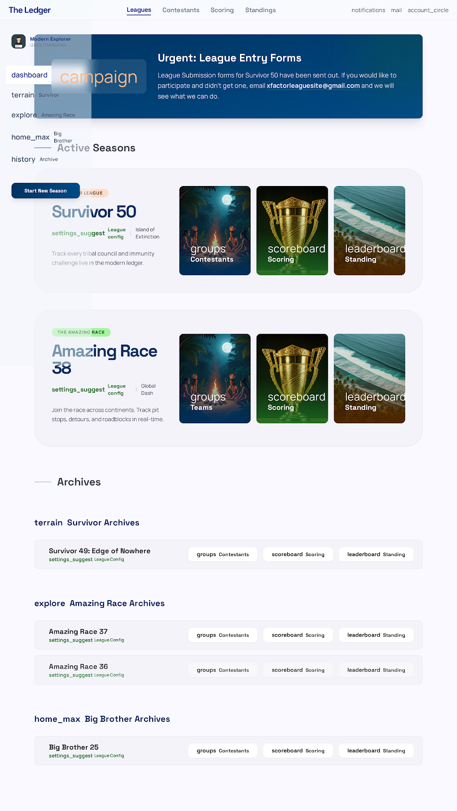
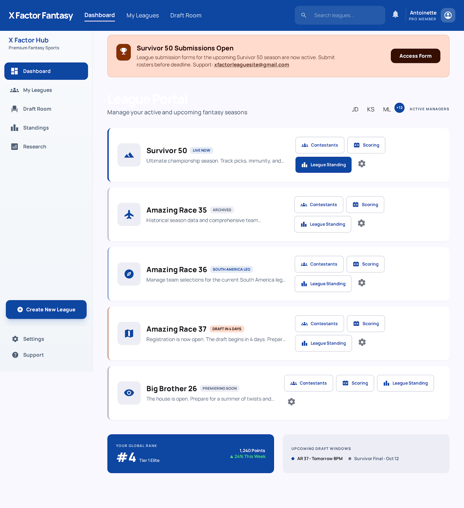
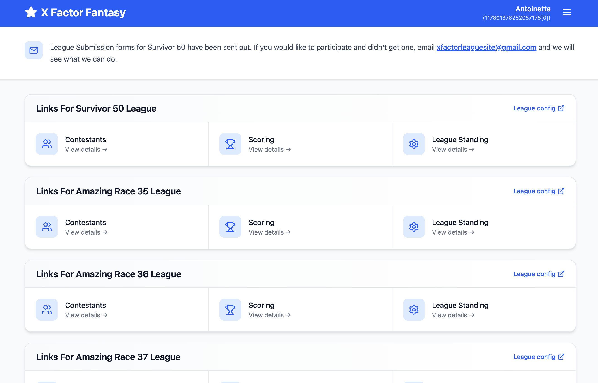
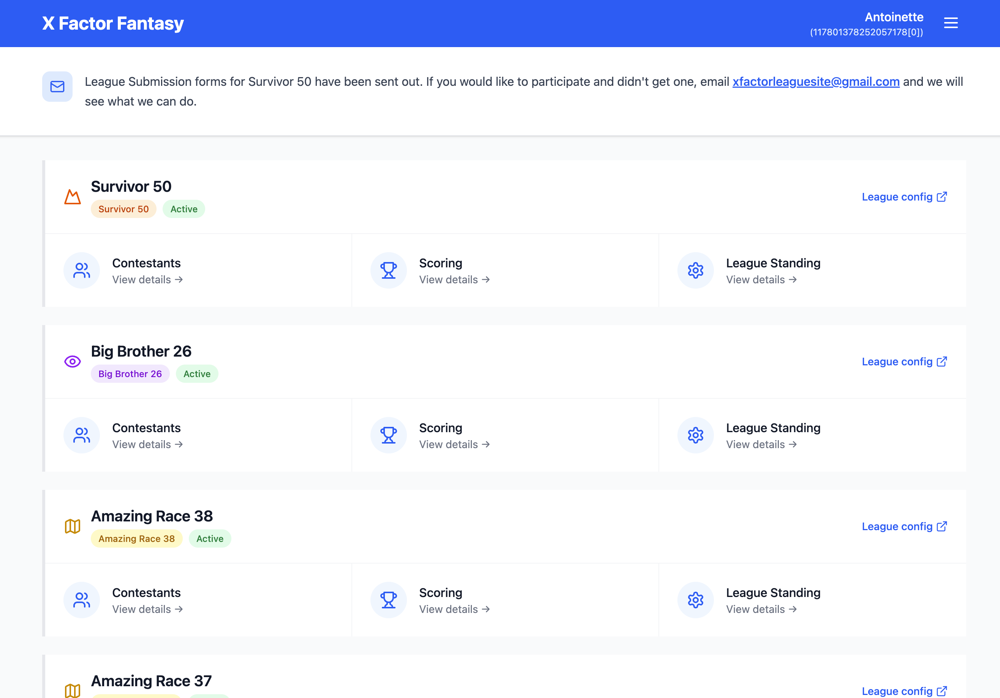

I started my career on the design side of the web before transitioning into front-end engineering. Back then, I spent a lot of time in tools like Photoshop, where I'd slice up layouts and translate them into code. My career led me to platforms like CodePen, where I could bring Dribbble posts to life with code. Over time, design tools evolved, and while Figma has become the standard, I've found learning new design tools overwhelming, especially when I just want to make quick, iterative improvements rather than build something from scratch.
With the rise of AI-powered design tools, I was curious how these programs might fit into my workflow, especially for people who don't come from a professional design background. I decided to try out two tools I keep seeing: Google Stitch and Figma Make. I decided to compare and contrast these two tools using the same intentionally vague prompt: "Improve this design while maintaining the navigation bar element." The goal wasn't to get a perfect redesign, but to see how well these tools could make thoughtful, incremental improvements without losing the original intent.

## Google Stitch
I had heard a lot of hype around Google Stitch, so I went in with fairly high expectations. In practice, I was disappointed. The changes the platform made felt more like a full redesign than a refinement. It introduced a lot of imagery that didn't quite fit, including awkwardly generated human images and the introduction of irrelevant terminology such as "hub". More importantly, it lost the spirit of the original design. Instead of building on what was there, it seemed to replace it entirely, making the tool harder to use as part of an iterative workflow.

Even after multiple attempts, the results barely improved. I increased the prompt’s specificity, hoping that would rein things in and lead to changes that aligned spiritually with the original. The output still leaned toward broad reinterpretations. Each iteration felt disconnected from the last, as if the tool wasn’t really “learning” from the direction I attempted to give it. Instead of refining the same idea, it created drastic changes, disrupting any real momentum and eroding trust in the process.

## Figma Make

Next, I tried Figma Make. I'll admit, my expectations were pretty low going in after my experience with Google Stitch. I was pleasantly surprised by how wrong I was. Figma Make fit significantly better for what I was looking for. The changes felt more natural and grounded in the original design. It preserved the core structure and intent while making adjustments that actually felt like improvements rather than a complete overhaul. The workflow felt closer to how a designer might iterate on a layout, making small but meaningful changes instead of starting over.

That said, Figma Make isn't perfect. The free tier is pretty limiting. Consumers can only make a handful of changes per day, which can interrupt your flow if you're experimenting. It also doesn't currently allow you to export the designs (at least in the free mode). This limitation increases friction for those looking to take their ideas into a real production workflow. Still, even with those limitations, it felt more aligned with how I naturally like to work.

Overall, with my limited design experience, I found myself preferring Figma Make. It supports an incremental process while keeping the essence of the original design intact. I felt less like handing control over to a tool and more like collaborating with it. For non-designers especially, that kind of balance feels important. If you're looking for help redesigning or iterating on a design you have already, be sure to check out the cool tools that are out there. I can't wait to see what you all make!